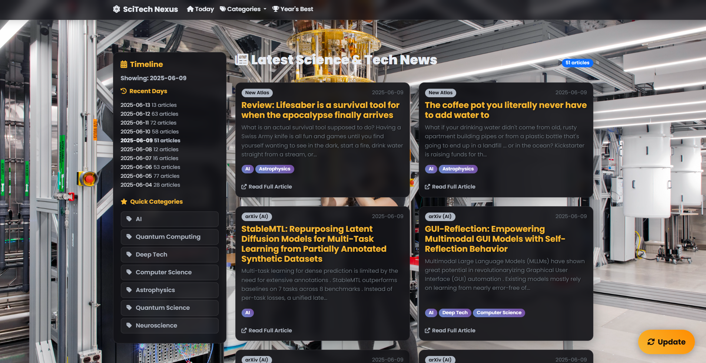

# SciTech Nexus

An AI-powered news aggregator built with Python & Flask. Fetches, categorizes, and summarizes the latest breakthroughs in science and technology into a modern, easy-to-use interface.



## About The Project

In a world with an overwhelming amount of information, finding curated, relevant news on scientific and technological advancements can be challenging. SciTech Nexus solves this by aggregating content from top-tier sources like Nature, Science Magazine, Phys.org, and arXiv. It then uses a Hugging Face AI model to provide concise summaries and automatically categorizes articles, presenting them in a beautiful, responsive, and dark-themed interface.

This project was built to demonstrate a full-stack application combining web scraping, backend development, database management, AI integration, and modern frontend design.

## Key Features

- **Multi-Source Aggregation**: Fetches articles from multiple reputable sources using their RSS/API feeds.
- **AI-Powered Summarization**: Utilizes a `transformers` model to generate concise summaries of articles.
- **Automatic Categorization**: Classifies articles into specific domains (AI, Quantum Computing, Biotechnology, etc.) based on keywords.
- **Timeline View**: Browse news by specific publication dates.
- **Category Filtering**: View all articles belonging to a specific category.
- **Yearly Breakthroughs**: A dedicated page to view the most significant articles of the year.
- **Modern UI/UX**: A responsive, dark-themed, and mobile-friendly interface with a "glassmorphism" design.
- **Background Updates**: A non-blocking update mechanism allows users to continue browsing while new articles are fetched in the background.

## Tech Stack

- **Backend**: Python, Flask
- **Database**: SQLite
- **AI / NLP**: Hugging Face Transformers, PyTorch
- **Web Scraping & Parsing**: Requests, BeautifulSoup, python-dateutil
- **Frontend**: HTML5, CSS3, JavaScript, Jinja2, Bootstrap 5

## Getting Started

Follow these instructions to get a copy of the project up and running on your local machine for development and testing.

### Prerequisites

- Python 3.9+ and `pip` installed.
- `git` for cloning the repository.

### Installation

1.  **Clone the repository:**
    ```sh
    git clone https://github.com/your-username/SciTech-Nexus.git
    cd SciTech-Nexus
    ```

2.  **Create and activate a virtual environment:**

    This is crucial for managing project dependencies.

    **Note for Windows Users:** If running `python -m venv .venv` creates a `bin` folder instead of `Scripts`, your default python might be from an environment like `msys64`. To fix this, create the venv by providing the full path to your standard Python installation.

    ```bash
    # For Windows (using an explicit Python path if needed)
    # "C:\Path\To\Your\Python\python.exe" -m venv .venv
    .venv\Scripts\activate

    # For macOS / Linux
    python3 -m venv .venv
    source .venv/bin/activate
    ```

3.  **Install the required packages:**
    ```sh
    pip install -r requirements.txt
    ```
    *This may take some time as it will download PyTorch and the Transformers library.*

4.  **Run the application:**
    ```sh
    python app.py 
    ```
    *(or `python scitechnexus.py` if you named it that)*

5.  **Open your browser** and navigate to `http://127.0.0.1:5000`.

## Usage

- **Homepage**: The main page displays articles from the current day.
- **Update Button**: The floating "Update" button on the bottom-right fetches the latest articles from all sources. This process runs in the background. You will receive an alert when it starts.
- **Navigation**: Use the top navigation bar to filter by **Categories** or view the **Year's Best** articles. Use the **Timeline** sidebar on the left to browse news from previous dates.

## Configuration

You can easily customize the application by modifying the configuration dictionaries at the top of `app.py`:

-   **`NEWS_SOURCES_CONFIG`**: Add, remove, or edit news sources. Ensure you provide a valid RSS/API URL and set the correct `type` ('rss' or 'arxiv').
    ```python
    'New Source': {
        'url': 'https://example.com/rss.xml',
        'type': 'rss',
        'base_url': 'https://example.com/'
    }
    ```
-   **`CATEGORIES_KEYWORDS`**: Add new categories or refine the keywords for existing ones to improve classification accuracy.
    ```python
    'New Category': ['keyword1', 'keyword2', 'keyword3']
    ```

## License

Distributed under the MIT License. See `LICENSE` for more information.

## Acknowledgements

- [Flask](https://flask.palletsprojects.com/)
- [Hugging Face Transformers](https://huggingface.co/docs/transformers/index)
- [BeautifulSoup](https://www.crummy.com/software/BeautifulSoup/)
- [Bootstrap](https://getbootstrap.com/)
- [Font Awesome](https://fontawesome.com/)
- [Google Fonts](https://fonts.google.com/)